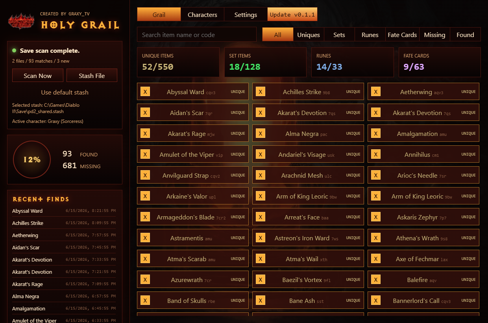
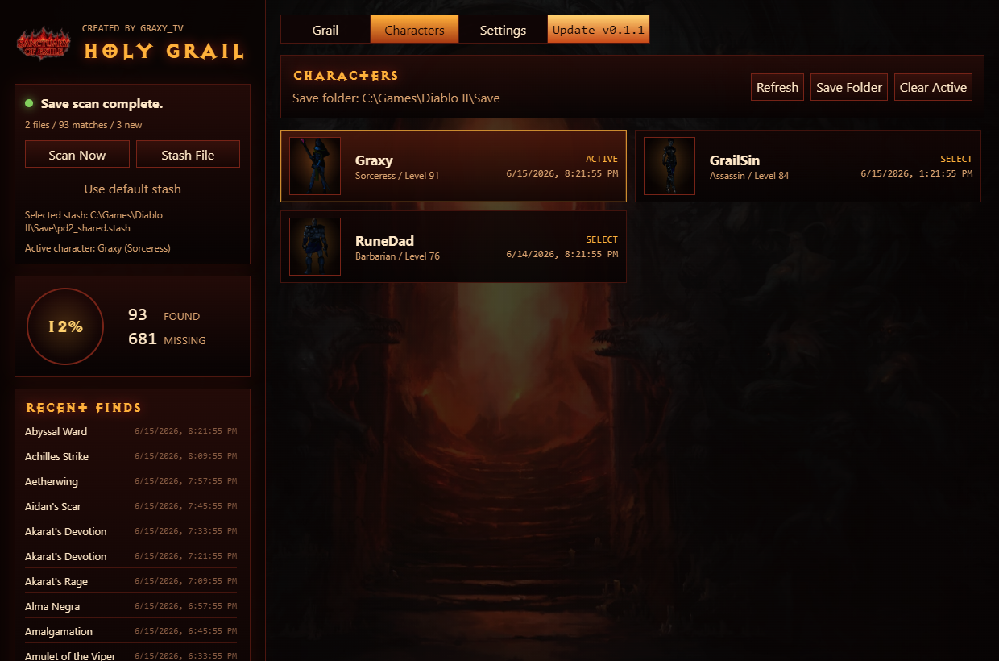
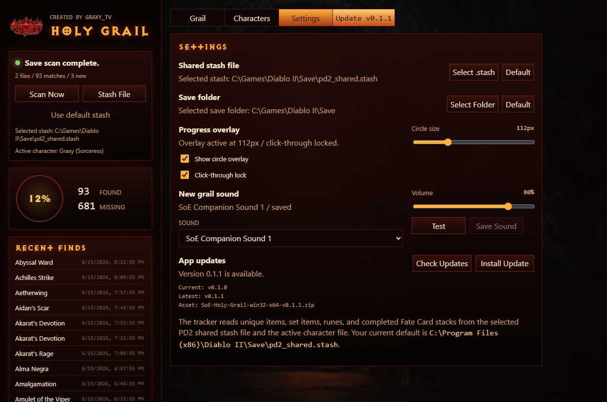

# SoE Holy Grail

Sanctuary of Exile holy grail tracker created by Graxy_TV.

SoE Holy Grail is a desktop tracker for Sanctuary of Exile players who want automatic grail progress without keeping every item forever. It scans your shared stash and selected character save, marks new grail completions, and keeps those completions permanently after the first discovery.

## Screenshots

### Grail Tracking



### Character Scanner



### Settings, Sounds, And Updates



## Features

- Sanctuary of Exile-only item catalog.
- Tracks unique items, set items, runes, and Fate Cards.
- Fate Cards complete after one full required stack is found.
- Automatic scans for `pd2_shared.stash`, `pd2_hc_shared.stash`, and the selected `.d2s` character.
- Persistent grail history, so items stay completed even if you drop or trade them later.
- Character tab with Diablo II class portraits.
- Recent Finds panel for the latest 20 grail completions.
- Optional always-on-top progress circle overlay with new-find popup.
- Configurable new-grail sound using bundled SoE Companion sounds and FilterBlade sound options.
- In-app update checking and portable update install support through GitHub Releases.

## Download

Download the latest Windows portable zip from GitHub Releases:

```txt
SoE-Holy-Grail-win32-x64-vX.Y.Z.zip
```

Extract it anywhere and run:

```txt
SoE Holy Grail.exe
```

## Setup

1. Open Settings.
2. Select your shared stash file if the default is not correct.
3. Open Characters and select the character you are actively playing.
4. Use Scan Now or let the app auto-sync after save and exit.

Default shared stash path:

```txt
C:\Program Files (x86)\Diablo II\Save\pd2_shared.stash
```

## Data

User progress is stored outside the app folder at:

```txt
%APPDATA%\soe-holy-grail\grail-state.json
```

The app keeps grail completions after first discovery. Auto-scans add newly completed entries but do not remove old completions when items leave your stash or inventory.

## Releases And Updates

The in-app updater checks GitHub releases at `graxytv/soe-holy-grail`, using the app version in `package.json`.

Release flow:

1. Update `version` in `package.json`.
2. Copy the current source into `SoE Holy Grail Runtime\resources\app`.
3. Run:

```powershell
powershell -ExecutionPolicy Bypass -File .\scripts\package-release.ps1
```

4. Create a GitHub release tagged like `v0.1.1`.
5. Upload the generated `dist\SoE-Holy-Grail-win32-x64-v0.1.1.zip` asset.

Players can check and install updates from Settings. When a newer release with a matching Windows zip exists, an Update button appears beside the Settings tab.
